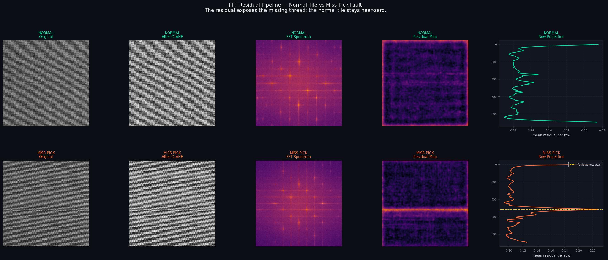
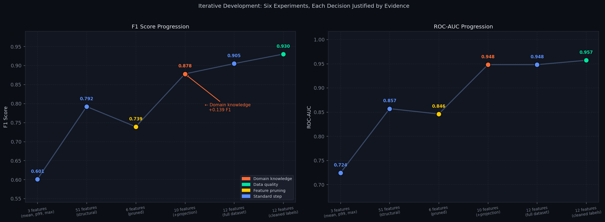
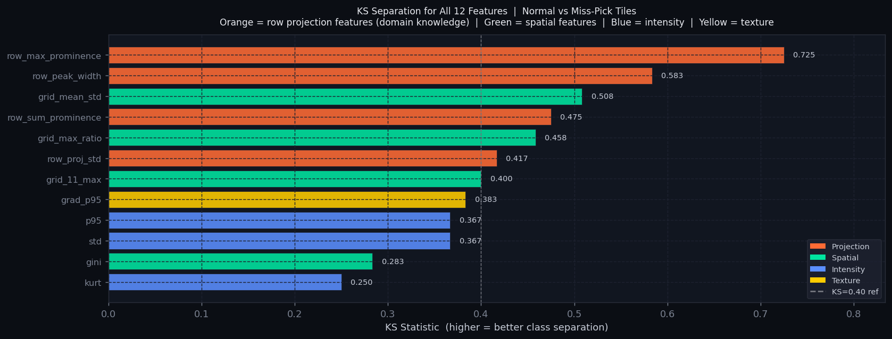

# Fabric Fault Detection via FFT Residual Analysis

> **Classical computer vision for industrial quality control — interpretable, trainable on small datasets, no deep learning required.**

[](https://www.python.org/)
[](LICENSE)

---

## The problem

Fabric is woven on industrial looms at high speed. Faults — missing threads, extra threads, broken threads — slip through and reach customers. Manual inspection is slow, inconsistent, and doesn't scale.

Automated detection needs to be:
- **Reliable** — catch ≥ 90% of faults in production
- **Interpretable** — operators need to know *why* a tile was flagged
- **Trainable on small data** — collecting labeled fabric images is expensive

## The approach

Fabric has a periodic structure. Every thread crossing happens at a predictable interval. The Fourier Transform isolates that periodic background. Subtract it from the original tile — what remains is the **residual**: everything that doesn't fit the weave pattern. Faults live in the residual.

```
Raw tile → CLAHE → FFT → isolate weave frequencies → reconstruct background
         → residual = |original − reconstruction| → 12 features → SVM
```



The reconstruction is what a *perfect* tile would look like. The residual exposes what's wrong. This requires no training for the signal processing stage — the ML only needs to classify the resulting 12-number feature vector.

## Results



| Experiment | What changed | F1 | AUC | Key finding |
|---|---|---|---|---|
| Baseline | 3 global features, Random Forest | 0.601 | 0.724 | All features correlated (r>0.85) — effectively 1 feature |
| +Structural | 51 features added | 0.792 | 0.857 | Train/test gap = 0.183 — overfitting |
| Feature pruning | 51 → 6 features | 0.739 | 0.846 | Gap fixed (0.019). Hit feature ceiling |
| **Domain insight** | **Row projection spike detection** | **0.878** | **0.948** | **+0.139 F1 from one insight** |
| More data | All 3 fault types, 1406 tiles | 0.905 | 0.948 | Per-fault-type recall validated |
| **Label cleaning** | **24 mislabeled tiles removed** | **0.930** | **0.957** | **Model found annotation errors** |

**Final model: F1 = 0.930 · AUC = 0.957 · Recall = 0.901 · Train/test gap = 0.000**

---

## Why not a neural network?

Three reasons specific to this problem:

**1. Small dataset.** ~1400 tiles total. CNNs need 10,000+ per class to generalise reliably. SVM with 12 features works well at this scale — samples/features ratio of 117:1 ensures clean generalisation.

**2. Interpretability is a hard requirement.** A CNN says "faulty, 94% confidence." This system says: *"horizontal stripe at row 420, prominence 0.14 — consistent with a miss-pick fault."* Every prediction traces back to a specific measurement.

**3. The physics fit classical tools exactly.** Fabric has a known periodic structure. Designing features that exploit this structure outperformed a data-driven PCA decomposition (F1 0.878 vs 0.857) with 4 features instead of 21 PCA components.

---

## The 12 features



Features were selected by KS statistic (class separation), correlation analysis (removing redundancy), and generalisation diagnostics (train/test gap). Each feature answers a specific question about the residual.

| Feature | Group | KS | What it detects |
|---|---|---|---|
| `row_max_prominence` | Projection | 0.720 | Height of spike in row projection — **miss-pick stripe** |
| `row_sum_prominence` | Projection | 0.607 | Total spike energy across all rows |
| `row_peak_width` | Projection | 0.607 | Physical width of the stripe (thread count) |
| `grid_mean_std` | Spatial | 0.493 | Non-uniformity across 3×3 tile grid |
| `grid_max_ratio` | Spatial | 0.487 | How much one region stands out |
| `grad_p95` | Texture | 0.407 | Sharpness of fault boundaries |
| `row_proj_std` | Projection | 0.440 | Row projection variability |
| `std` | Intensity | 0.400 | Variance between fault and background |
| `p95` | Intensity | 0.373 | Overall residual magnitude |
| `grid_11_max` | Spatial | 0.393 | Peak residual in centre region |
| `gini` | Spatial | 0.327 | Spatial concentration of anomaly |
| `kurt` | Intensity | 0.227 | Tail heaviness — few extreme pixels |

The biggest lesson: `row_max_prominence` (KS=0.720) was discovered through domain knowledge — miss-pick faults are horizontal stripes. It is nearly **3× stronger** than the best statistical feature. Knowing what a fault looks like physically was worth more than any algorithmic approach.

---

## Key findings from the research process

**Normalisation matters more than expected.** Two FFT normalisation strategies were compared across all 12 features on 300 tiles. Independent min-max scaling won on **12/12 features** (AUC delta = +0.182 vs shared scaling). The mechanism: independent scaling amplifies reconstruction error proportionally to fault severity — it acts as automatic gain control. See `experiments/01_normalisation_comparison.ipynb`.

**Tukey windowing failed.** Applied to reduce spectral leakage at tile borders. Edge ratio worsened from 1.25× to 1.55×. Cause: the window tapers the FFT input to zero at borders, but the residual compares against the original unwindowed image — creating large differences exactly where the window was applied. See `experiments/03_edge_margin_tukey.ipynb`.

**The model found annotation errors.** 24 tiles labeled "faulty" had P(fault) < 0.40 — the model was confident they were normal. Visual inspection confirmed: no fault visible in the original tile or residual. These were mislabeled (normal tiles in the fault directory). Removing them reduced the FN rate from 14.1% to 10.0%. See `experiments/05_label_noise_analysis.ipynb`.

---

## Fault types

| Fault | Description | Tiles | Primary detector |
|---|---|---|---|
| Miss-pick | Missing weft thread(s) — horizontal stripe | 1073 | `row_max_prominence` |
| Double-pick | Extra weft thread — horizontal density variation | 85 | `grid_mean_std`, `gini` |
| Broken-pick | Broken weft thread — localised anomaly | 17 | `p95`, `grid_max_ratio` |

All treated as a single FAULTY class for Stage 1. A Stage 2 fault-type classifier is planned.

---

## Repository structure

```
├── notebooks/
│   └── fabric_fault_detection.ipynb   ← Full narrative notebook (run with outputs)
│
├── experiments/                        ← Individual investigation notebooks
│   ├── 01_normalisation_comparison.ipynb
│   ├── 02_feature_development.ipynb
│   ├── 03_edge_margin_tukey.ipynb
│   ├── 04_pca_vs_handcrafted.ipynb
│   └── 05_label_noise_analysis.ipynb
│
├── src/                               ← Importable pipeline modules
│   ├── pipeline.py                    ← FFT residual computation
│   ├── features.py                    ← 12-feature extraction
│   └── train.py                       ← Dataset, training, evaluation
│
├── model/                             ← Trained model artifacts
│   ├── fault_detector.pkl
│   ├── qc_threshold.pkl               ← 0.641 (recall ≥ 0.90)
│   └── feature_cols.pkl
│
├── assets/                            ← Figures for this README
├── sample_tiles/                      ← 5 tiles per class for smoke testing
├── scripts/
│   └── dataset_prepare.py             ← Dataset curation and reviewer handoff
└── CHANGELOG.md                       ← Full iterative history with metrics
```

---

## Quickstart

```bash
git clone https://github.com/YOUR_USERNAME/fabric-fault-detection
cd fabric-fault-detection
pip install -r requirements.txt
```

**Classify a tile:**
```python
from src.train import predict_tile

result = predict_tile('path/to/tile.jpg', model_dir='model')
print(result['is_faulty'])     # True / False
print(result['probability'])   # 0.847
print(result['features']['row_max_prominence'])  # 0.142 — the spike that triggered it
```

**Run the notebook:**
See `data/README.md` for dataset placement instructions.
Open `notebooks/fabric_fault_detection.ipynb` in Colab or locally.

---

## What's next

- **FFT parameter grid search** — `N_PEAKS` and `PEAK_RADIUS` were set by visual inspection on miss-pick data. Systematic tuning planned once dataset reaches 150+ tiles per fault type.
- **Column projection features** — for warp-direction faults (broken end, double end). Currently omitted because column KS was near-zero on miss-pick-only data.
- **Expanded dataset** — 23 fault types identified in production data. Structured review pipeline built (`scripts/dataset_prepare.py`).
- **Stage 2 fault-type classifier** — classifies which fault was detected after Stage 1 flags a tile.

---

## Dependencies

```
numpy>=1.24  pandas>=2.0  opencv-python>=4.8  scikit-learn>=1.3
scikit-image>=0.21  scipy>=1.11  tqdm>=4.65  joblib>=1.3  matplotlib>=3.7
```

---

*Dataset not included (proprietary). See `data/README.md` for setup instructions.*
*All experiments reproducible with fixed random seeds (seed=42).*
